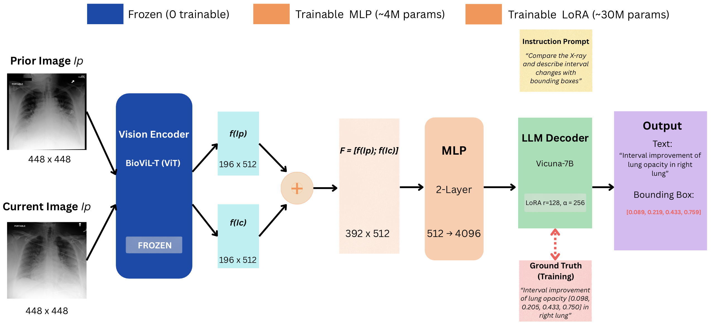
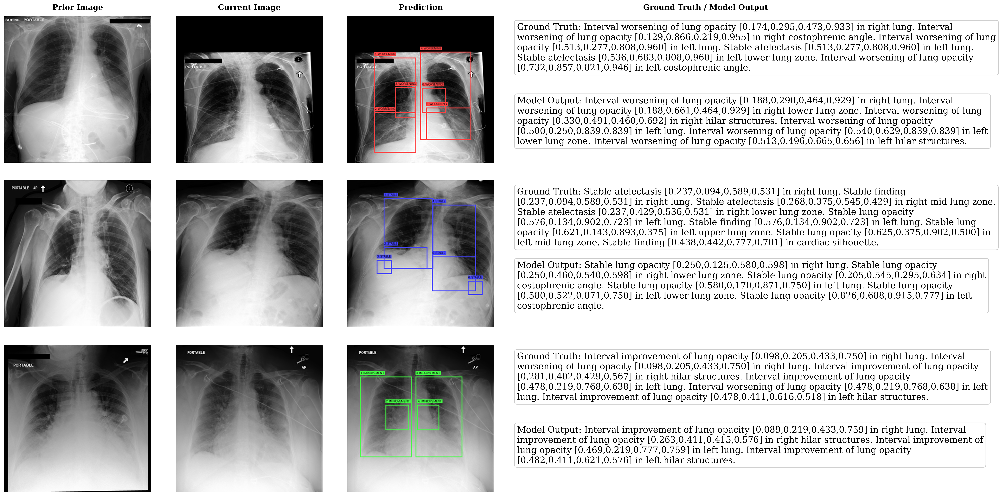

# TRACE: Temporal Radiology with Anatomical Change Explanation

TRACE is the first model for **grounded temporal change detection** in chest X-rays. Given a prior and current study, TRACE generates natural language descriptions of interval changes (worsened, improved, stable) while localizing each finding with bounding box coordinates.



## Key Results

| Metric | Value |
|--------|-------|
| Change Detection Accuracy | 48.0% |
| Grounding IoU > 0.5 | 90.2% |
| Mean IoU | 0.772 |
| BLEU-4 | 0.260 |
| RadGraph F1 | 0.406 |

### Comparison with Prior Methods

| Method | Temporal Acc. | Grounding IoU | Report Gen |
|--------|--------------|---------------|------------|
| CheXRelNet | 46.8% | -- | ✗ |
| CheXRelFormer | 49.3% | -- | ✗ |
| **TRACE (Ours)** | **48.0%** | **90.2%** | ✓ |

## Qualitative Results



## Installation
```bash
conda create --name trace python=3.10
conda activate trace
conda install pytorch==2.0.1 torchvision==0.15.2 pytorch-cuda=11.7 -c pytorch -c nvidia
pip install -r requirements.txt
```

## Data Preparation

### 1. Download MIMIC-CXR-JPG
Download from [PhysioNet](https://physionet.org/content/mimic-cxr-jpg/2.0.0/)

### 2. Download Chest ImaGenome
Download from [PhysioNet](https://physionet.org/content/chest-imagenome/1.0.0/)

### 3. Prepare Temporal Grounding Data
```bash
python prepare_temporal_grounding_data.py
```

## Model Checkpoints

Download pretrained checkpoints from [Hugging Face](https://huggingface.co/) (coming soon)

Place checkpoints in:
- `checkpoints/radialog-v2/` - Pretrained adapter
- `trace_model/checkpoints/temporal_grounding_v1/` - TRACE model

## Training
```bash
cd trace_model
bash scripts/train_temporal_grounding.sh
```

### Ablation Training
```bash
# Single image (no prior)
bash scripts/ablations/train_single_image.sh

# No grounding supervision
bash scripts/ablations/train_no_grounding.sh
```

## Evaluation

### Main Evaluation
```bash
python eval_main.py
```

### Ablation Studies
```bash
python eval_ablation_single_image.py
python eval_ablation_no_grounding.py
```

### LLM Comparison
```bash
python eval_llm_comparison.py
```

## Demo
```bash
python demo.py
```

## Project Structure
```
TRACE/
├── trace_model/                      # Core model code
│   ├── llava/model/           # Temporal grounding architecture
│   ├── llava/train/           # Training scripts
│   └── scripts/               # Shell scripts
├── biovil_t/                  # BioViL-T vision encoder
├── eval_main.py               # Main evaluation script
├── eval_ablation_*.py         # Ablation evaluations
├── eval_llm_comparison.py     # Vicuna vs Mistral comparison
├── demo.py                    # Interactive demo
└── prepare_temporal_grounding_data.py  # Data preparation
```

## Acknowledgments

This work builds upon [RaDialog](https://github.com/ChantalMP/RaDialog) and [LLaVA](https://github.com/haotian-liu/LLaVA).

## License

This project is licensed under the MIT License.
